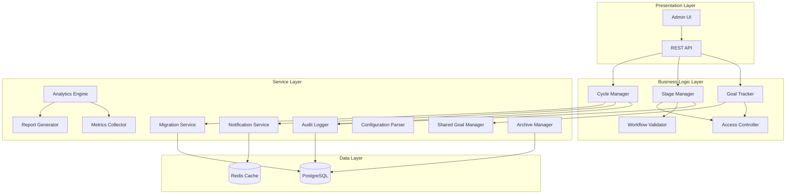
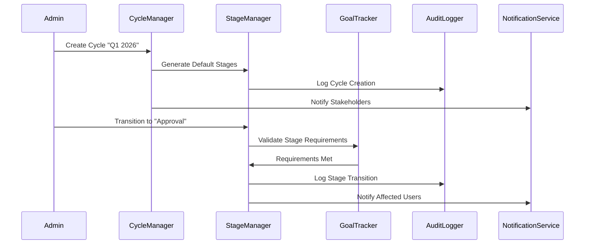

# Design Document — Enterprise Cycle-Stage Management

## Overview

The Enterprise Cycle-Stage Management system addresses a fundamental architectural flaw in the current Goal Tracking Portal where phases (GOAL_SETTING, Q1, Q2, Q3, Q4) are incorrectly treated as separate cycles instead of stages within a single cycle. This design implements a proper enterprise workflow where one cycle (e.g., "Q1 2026") contains multiple sequential stages that maintain goal continuity throughout the entire cycle.

### Key Design Principles

1. **Goal Continuity**: Goals remain visible and trackable throughout all stages within the same cycle
2. **Stage-Based Workflow**: Each stage represents different activities (Planning, Approval, Locked, Execution, Review) within a single cycle
3. **Enterprise Compliance**: Proper audit trails, access controls, and reporting for enterprise environments
4. **Seamless Migration**: Preserve existing data while transforming the architecture
5. **Performance Optimization**: Efficient data structures and query patterns for large-scale deployments

### Problem Statement

The current system's phase-based approach causes:
- **Goal Visibility Issues**: Goals disappear between phases, breaking user experience
- **Broken Reporting**: QoQ analysis impossible due to disconnected phase data
- **Employee Confusion**: Users lose track of goals across phase transitions
- **Duplicate KPI Records**: Multiple records for the same logical goal period
- **Missing Goal Mapping**: No continuity for trend analysis and performance tracking

### Solution Architecture

The new cycle-stage architecture provides:
- **Unified Cycle Management**: Single cycle contains all stages for a goal period
- **Stage-Based Access Control**: Different permissions and capabilities per stage
- **Continuous Goal Tracking**: Goals remain visible and accessible throughout the cycle
- **Proper Enterprise Workflow**: Sequential stage progression with validation and audit trails
- **QoQ Analytics**: Proper data relationships enable quarter-over-quarter trend analysis

## Architecture

### System Components



### Data Flow Architecture



### Component Responsibilities

#### Cycle Manager
- Create and manage cycles with proper quarterly naming
- Enforce cycle uniqueness constraints (one per quarter/year)
- Manage cycle activation (only one active cycle at a time)
- Coordinate with Stage Manager for default stage creation

#### Stage Manager
- Maintain stage lifecycle and sequential progression
- Validate stage transition requirements
- Record transition timestamps and initiating users
- Support admin override capabilities with reason logging

#### Goal Tracker
- Maintain goal visibility across all stages within a cycle
- Preserve goal data, achievements, and relationships during transitions
- Implement stage-appropriate access controls
- Coordinate with Shared Goal Manager for relationship maintenance

#### Access Controller
- Implement stage-based permissions (edit in Planning, view-only in Locked, etc.)
- Enforce workflow integrity based on current stage
- Support admin unlock capabilities for locked stages

#### Workflow Validator
- Prevent invalid operations based on current stage
- Provide clear error messages for workflow violations
- Log all violations for audit purposes

## Components and Interfaces

### Core Data Models

#### New Schema Design

```sql
-- New cycle-stage architecture
CREATE TABLE goal_cycles (
    id UUID PRIMARY KEY DEFAULT gen_random_uuid(),
    name VARCHAR(50) NOT NULL, -- "Q1 2026", "Q2 2026", etc.
    quarter VARCHAR(2) NOT NULL CHECK (quarter IN ('Q1', 'Q2', 'Q3', 'Q4')),
    year INTEGER NOT NULL CHECK (year >= 2000 AND year <= 2100),
    is_active BOOLEAN DEFAULT FALSE,
    created_by_id UUID NOT NULL REFERENCES users(id),
    created_at TIMESTAMP DEFAULT NOW(),
    updated_at TIMESTAMP DEFAULT NOW(),
    
    UNIQUE(quarter, year)
);

CREATE TABLE cycle_stages (
    id UUID PRIMARY KEY DEFAULT gen_random_uuid(),
    cycle_id UUID NOT NULL REFERENCES goal_cycles(id) ON DELETE CASCADE,
    stage_name VARCHAR(20) NOT NULL CHECK (stage_name IN ('Planning', 'Approval', 'Locked', 'Execution', 'Review')),
    is_active BOOLEAN DEFAULT FALSE,
    start_date TIMESTAMP,
    end_date TIMESTAMP,
    sequence_order INTEGER NOT NULL CHECK (sequence_order >= 1 AND sequence_order <= 5),
    created_at TIMESTAMP DEFAULT NOW(),
    updated_at TIMESTAMP DEFAULT NOW(),
    
    UNIQUE(cycle_id, stage_name),
    UNIQUE(cycle_id, sequence_order)
);

-- Modified existing tables
ALTER TABLE goal_sheets 
    DROP CONSTRAINT IF EXISTS goal_sheets_cycle_id_fkey,
    ADD CONSTRAINT goal_sheets_cycle_id_fkey 
    FOREIGN KEY (cycle_id) REFERENCES goal_cycles(id);

-- Stage transition audit table
CREATE TABLE stage_transitions (
    id UUID PRIMARY KEY DEFAULT gen_random_uuid(),
    cycle_id UUID NOT NULL REFERENCES goal_cycles(id),
    from_stage_id UUID REFERENCES cycle_stages(id),
    to_stage_id UUID NOT NULL REFERENCES cycle_stages(id),
    initiated_by_id UUID NOT NULL REFERENCES users(id),
    reason TEXT,
    is_admin_override BOOLEAN DEFAULT FALSE,
    transition_timestamp TIMESTAMP DEFAULT NOW()
);
```

### API Interface Design

#### Cycle Management Endpoints

```typescript
// POST /api/admin/cycles
interface CreateCycleRequest {
  quarter: 'Q1' | 'Q2' | 'Q3' | 'Q4';
  year: number;
  isActive?: boolean;
}

interface CreateCycleResponse {
  id: string;
  name: string; // Auto-generated: "Q1 2026"
  quarter: string;
  year: number;
  isActive: boolean;
  stages: CycleStage[];
  createdAt: string;
}

// PUT /api/admin/cycles/:id/stages/:stageId/transition
interface StageTransitionRequest {
  reason?: string;
  adminOverride?: boolean;
}

interface StageTransitionResponse {
  success: boolean;
  newStage: CycleStage;
  transitionId: string;
  message: string;
}
```

#### Stage Management Endpoints

```typescript
// GET /api/cycles/:id/stages
interface CycleStage {
  id: string;
  cycleId: string;
  stageName: 'Planning' | 'Approval' | 'Locked' | 'Execution' | 'Review';
  isActive: boolean;
  startDate: string | null;
  endDate: string | null;
  sequenceOrder: number;
  allowedActions: string[];
}

// GET /api/cycles/:id/current-stage
interface CurrentStageResponse {
  stage: CycleStage;
  allowedTransitions: string[];
  userPermissions: {
    canCreateGoals: boolean;
    canEditGoals: boolean;
    canDeleteGoals: boolean;
    canUpdateAchievements: boolean;
    canApproveGoals: boolean;
    canPerformCheckIns: boolean;
  };
}
```

#### Migration Endpoints

```typescript
// POST /api/admin/migration/legacy-to-cycle-stage
interface MigrationRequest {
  dryRun?: boolean;
  batchSize?: number;
}

interface MigrationResponse {
  success: boolean;
  migratedCycles: number;
  migratedGoals: number;
  errors: MigrationError[];
  auditLogId: string;
}

interface MigrationError {
  entityType: string;
  entityId: string;
  error: string;
  suggestion: string;
}
```

### Service Interfaces

#### Cycle Manager Service

```typescript
interface CycleManagerService {
  createCycle(request: CreateCycleRequest): Promise<CreateCycleResponse>;
  activateCycle(cycleId: string): Promise<void>;
  deactivateCycle(cycleId: string): Promise<void>;
  getActiveCycle(): Promise<GoalCycle | null>;
  getCyclesByYear(year: number): Promise<GoalCycle[]>;
  validateCycleName(quarter: string, year: number): Promise<boolean>;
}
```

#### Stage Manager Service

```typescript
interface StageManagerService {
  transitionStage(cycleId: string, toStageId: string, options: StageTransitionOptions): Promise<StageTransitionResult>;
  validateStageTransition(cycleId: string, toStageId: string): Promise<ValidationResult>;
  getCurrentStage(cycleId: string): Promise<CycleStage>;
  getStageHistory(cycleId: string): Promise<StageTransition[]>;
  adminOverrideStage(cycleId: string, toStageId: string, reason: string, adminId: string): Promise<StageTransitionResult>;
}

interface StageTransitionOptions {
  reason?: string;
  adminOverride?: boolean;
  initiatedBy: string;
}
```

#### Goal Tracker Service

```typescript
interface GoalTrackerService {
  getGoalsByCycle(cycleId: string, userId?: string): Promise<Goal[]>;
  preserveGoalDataOnStageTransition(cycleId: string, fromStage: string, toStage: string): Promise<void>;
  validateStageAppropriateActions(cycleId: string, action: string, userId: string): Promise<boolean>;
  maintainGoalRelationships(cycleId: string): Promise<void>;
  getGoalVisibilityRules(cycleId: string, userId: string): Promise<VisibilityRules>;
}
```

## Data Models

### Core Entities

#### GoalCycle Entity

```typescript
interface GoalCycle {
  id: string;
  name: string; // Auto-generated: "Q1 2026", "Q2 2026"
  quarter: 'Q1' | 'Q2' | 'Q3' | 'Q4';
  year: number;
  isActive: boolean;
  createdById: string;
  createdAt: Date;
  updatedAt: Date;
  
  // Relations
  stages: CycleStage[];
  goalSheets: GoalSheet[];
  sharedGoals: SharedGoal[];
  stageTransitions: StageTransition[];
}
```

#### CycleStage Entity

```typescript
interface CycleStage {
  id: string;
  cycleId: string;
  stageName: 'Planning' | 'Approval' | 'Locked' | 'Execution' | 'Review';
  isActive: boolean;
  startDate: Date | null;
  endDate: Date | null;
  sequenceOrder: number; // 1-5 for the five stages
  createdAt: Date;
  updatedAt: Date;
  
  // Relations
  cycle: GoalCycle;
  transitionsFrom: StageTransition[];
  transitionsTo: StageTransition[];
}
```

#### StageTransition Entity

```typescript
interface StageTransition {
  id: string;
  cycleId: string;
  fromStageId: string | null; // null for initial stage
  toStageId: string;
  initiatedById: string;
  reason: string | null;
  isAdminOverride: boolean;
  transitionTimestamp: Date;
  
  // Relations
  cycle: GoalCycle;
  fromStage: CycleStage | null;
  toStage: CycleStage;
  initiatedBy: User;
}
```

### Enhanced Existing Entities

#### Modified GoalSheet

```typescript
interface GoalSheet {
  // Existing fields remain the same
  id: string;
  employeeId: string;
  cycleId: string; // Now references goal_cycles instead of legacy cycles
  status: SheetStatus;
  // ... other existing fields
  
  // Enhanced relations
  cycle: GoalCycle; // Enhanced relationship
  currentStage?: CycleStage; // Computed from cycle.stages
}
```

#### Enhanced Goal Entity

```typescript
interface Goal {
  // Existing fields remain the same
  id: string;
  goalSheetId: string;
  // ... other existing fields
  
  // New stage-aware fields
  stageCreated: string; // Stage name when goal was created
  lastModifiedStage: string; // Stage name when last modified
  stagePermissions: StagePermissions; // Computed based on current stage
}

interface StagePermissions {
  canEdit: boolean;
  canDelete: boolean;
  canUpdateAchievements: boolean;
  canView: boolean;
  canApprove: boolean;
}
```

### Configuration Models

#### CycleConfiguration

```typescript
interface CycleConfiguration {
  id: string;
  name: string;
  template: 'quarterly' | 'semi-annual' | 'annual';
  stages: StageConfiguration[];
  defaultDurations: StageDuration[];
  notifications: NotificationConfiguration[];
  accessRules: AccessRuleConfiguration[];
}

interface StageConfiguration {
  name: string;
  sequenceOrder: number;
  requiredActions: string[];
  allowedRoles: Role[];
  autoTransitionRules?: AutoTransitionRule[];
}

interface StageDuration {
  stageName: string;
  defaultDurationDays: number;
  minDurationDays: number;
  maxDurationDays: number;
}
```

## Correctness Properties

*A property is a characteristic or behavior that should hold true across all valid executions of a system-essentially, a formal statement about what the system should do. Properties serve as the bridge between human-readable specifications and machine-verifiable correctness guarantees.*

### Property 1: Cycle Name Format Consistency
*For any* cycle creation with valid quarter and year parameters, the generated cycle name SHALL follow the format "{Quarter} {Year}" (e.g., "Q1 2026", "Q2 2026")
**Validates: Requirements 1.1**

### Property 2: Default Stage Generation Completeness
*For any* newly created cycle, the system SHALL automatically generate exactly five stages in the correct sequence: Planning (order 1), Approval (order 2), Locked (order 3), Execution (order 4), Review (order 5)
**Validates: Requirements 1.2**

### Property 3: Cycle Uniqueness Enforcement
*For any* attempt to create a cycle, if a cycle with the same quarter and year combination already exists, the system SHALL reject the creation with a descriptive error message
**Validates: Requirements 1.3, 1.4**

### Property 4: Single Active Cycle Invariant
*For any* cycle activation operation, after completion there SHALL be exactly one active cycle in the system, and all previously active cycles SHALL be deactivated
**Validates: Requirements 1.5**

### Property 5: Stage Sequence Validation
*For any* stage transition attempt, the system SHALL only allow transitions that follow the defined sequence (Planning → Approval → Locked → Execution → Review) unless an admin override is provided with a mandatory reason
**Validates: Requirements 2.1, 2.5**

### Property 6: Stage Transition Audit Completeness
*For any* stage transition (including admin overrides), the system SHALL create an audit record containing timestamp, initiating user, reason (if provided), and before/after stage information
**Validates: Requirements 2.3, 14.1, 14.2**

### Property 7: Goal Visibility Preservation
*For any* stage transition within a cycle, all goals that were visible before the transition SHALL remain visible after the transition, maintaining the same goal data, achievements, and relationships
**Validates: Requirements 3.1, 3.2, 3.4, 3.5**

### Property 8: Stage-Appropriate Access Control
*For any* user action attempt, the system SHALL allow or deny the action based on the current stage's access rules: goal creation/editing in Planning/Approval, achievement updates in Execution, check-ins in Review, and view-only in Locked (except admin unlock)
**Validates: Requirements 3.3, 5.1, 5.2, 5.3, 5.4, 5.5**

### Property 9: Migration Data Preservation
*For any* legacy goal cycle record processed during migration, all goal data, achievements, user relationships, and audit history SHALL be preserved in the new cycle-stage structure with correct mappings
**Validates: Requirements 4.2, 4.3**

### Property 10: Workflow Validation Consistency
*For any* workflow action attempt (goal submission, achievement update, manager check-in), if the action is not appropriate for the current stage, the system SHALL prevent the action and return a clear error message indicating the current stage and allowed actions
**Validates: Requirements 7.1, 7.2, 7.3, 7.4**

### Property 11: Shared Goal Synchronization Integrity
*For any* shared goal update within a cycle, the changes SHALL propagate to all linked employee sheets within the same cycle while preserving weightage assignments and preventing orphaned relationships
**Validates: Requirements 11.1, 11.2, 11.3, 11.4**

### Property 12: Notification Delivery Completeness
*For any* stage transition, the system SHALL send notifications to all affected users based on their roles, including stage-specific action items and deep links to relevant pages
**Validates: Requirements 9.1, 9.2, 9.3, 9.4**

### Property 13: Archive Data Integrity
*For any* cycle marked for archival, the compression and storage process SHALL preserve all data such that restoration produces exactly the same data as the original, maintaining read-only access for reporting
**Validates: Requirements 15.2, 15.3, 15.4**

### Property 14: Configuration Validation Robustness
*For any* cycle configuration input, the parser SHALL validate stage sequences, timing rules, and naming conventions, returning detailed error messages with suggested corrections for any violations
**Validates: Requirements 13.1, 13.2, 13.3, 13.5**

### Property 15: Database Constraint Enforcement
*For any* data operation on the new schema, foreign key relationships and integrity constraints SHALL be enforced, preventing orphaned records and maintaining referential integrity
**Validates: Requirements 8.4**

## Error Handling

### Error Categories and Handling Strategies

#### Validation Errors
- **Cycle Creation Errors**: Duplicate quarter/year, invalid naming format, missing required fields
- **Stage Transition Errors**: Invalid sequence, unmet requirements, missing permissions
- **Workflow Errors**: Actions not allowed in current stage, insufficient permissions
- **Configuration Errors**: Invalid stage definitions, timing conflicts, naming violations

#### System Errors
- **Database Errors**: Connection failures, constraint violations, transaction rollbacks
- **Migration Errors**: Data corruption, mapping failures, rollback scenarios
- **Integration Errors**: External service failures, notification delivery issues

#### Error Response Format

```typescript
interface ErrorResponse {
  error: {
    code: string;
    message: string;
    details?: Record<string, unknown>;
    suggestions?: string[];
    timestamp: string;
    requestId: string;
  };
}

// Example error responses
const CYCLE_ERRORS = {
  DUPLICATE_CYCLE: {
    code: 'CYCLE_001',
    message: 'A cycle for {quarter} {year} already exists',
    suggestions: ['Use a different quarter/year combination', 'Update the existing cycle instead']
  },
  INVALID_STAGE_TRANSITION: {
    code: 'STAGE_001',
    message: 'Cannot transition from {fromStage} to {toStage}',
    suggestions: ['Follow the correct stage sequence', 'Use admin override if necessary']
  },
  WORKFLOW_VIOLATION: {
    code: 'WORKFLOW_001',
    message: 'Action {action} not allowed in {currentStage} stage',
    suggestions: ['Wait for the appropriate stage', 'Contact admin for stage transition']
  }
};
```

### Error Recovery Mechanisms

#### Automatic Recovery
- **Transaction Rollback**: All database operations wrapped in transactions with automatic rollback on failure
- **Retry Logic**: Automatic retry for transient failures (network issues, temporary database unavailability)
- **Graceful Degradation**: System continues operating with reduced functionality during partial failures

#### Manual Recovery
- **Admin Override**: Administrators can override stage transitions and workflow restrictions with mandatory reason logging
- **Data Repair Tools**: Administrative tools for fixing data inconsistencies and orphaned records
- **Migration Rollback**: Ability to rollback migration operations if issues are detected

#### Monitoring and Alerting
- **Error Rate Monitoring**: Track error rates by category and trigger alerts for unusual patterns
- **Performance Monitoring**: Monitor stage transition times and system performance metrics
- **Audit Trail Monitoring**: Ensure all critical operations are properly logged and auditable

## Testing Strategy

### Dual Testing Approach

The testing strategy employs both unit tests for specific scenarios and property-based tests for comprehensive coverage of the correctness properties defined above.

#### Unit Testing Focus Areas
- **Specific Examples**: Test concrete scenarios like "Q1 2026" cycle creation, specific stage transitions
- **Edge Cases**: Boundary conditions, error scenarios, admin overrides
- **Integration Points**: API endpoints, database operations, external service interactions
- **Migration Scenarios**: Specific legacy data conversion cases

#### Property-Based Testing Configuration

**Framework**: Using `fast-check` for TypeScript/JavaScript property-based testing
**Test Configuration**: Minimum 100 iterations per property test
**Test Tagging**: Each property test tagged with format: **Feature: cycle-stage-management, Property {number}: {property_text}**

**Example Property Test Structure**:
```typescript
// Feature: cycle-stage-management, Property 1: Cycle Name Format Consistency
test('cycle name format consistency', () => {
  fc.assert(fc.property(
    fc.integer({ min: 2000, max: 2100 }),
    fc.constantFrom('Q1', 'Q2', 'Q3', 'Q4'),
    (year, quarter) => {
      const cycle = createCycle({ quarter, year });
      expect(cycle.name).toBe(`${quarter} ${year}`);
    }
  ), { numRuns: 100 });
});
```

#### Integration Testing
- **Database Schema Migration**: Test migration scripts with representative data sets
- **API Endpoint Testing**: Test all REST endpoints with various input combinations
- **External Service Integration**: Test notification services, audit logging, reporting systems
- **End-to-End Workflow Testing**: Complete cycle lifecycle from creation to archival

#### Performance Testing
- **Load Testing**: Test system performance with large numbers of cycles, stages, and goals
- **Stress Testing**: Test system behavior under extreme load conditions
- **Migration Performance**: Test migration performance with large legacy datasets

#### Security Testing
- **Access Control Testing**: Verify stage-based permissions are properly enforced
- **Audit Trail Testing**: Ensure all sensitive operations are properly logged
- **Input Validation Testing**: Test all inputs for injection attacks and malformed data

### Test Data Management
- **Test Data Generation**: Automated generation of test cycles, stages, goals, and users
- **Test Environment Isolation**: Separate test databases and environments for different test types
- **Test Data Cleanup**: Automated cleanup of test data after test execution

### Continuous Integration
- **Automated Test Execution**: All tests run automatically on code changes
- **Test Coverage Monitoring**: Track test coverage and ensure comprehensive coverage
- **Performance Regression Testing**: Monitor for performance regressions in critical paths